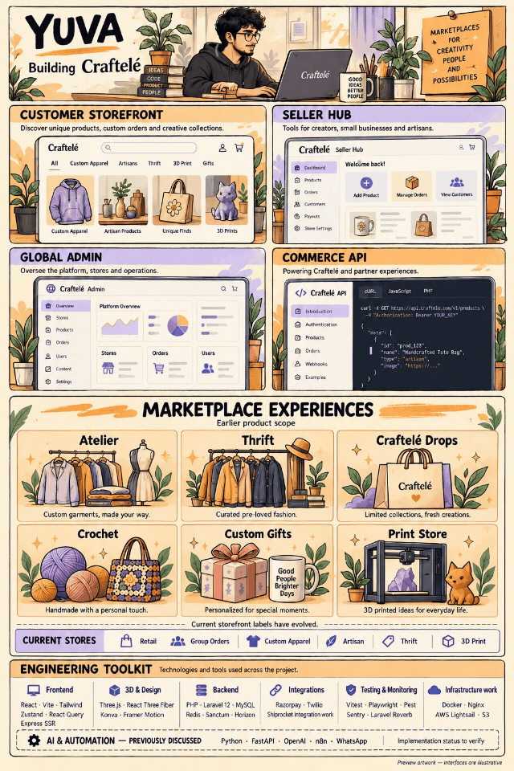
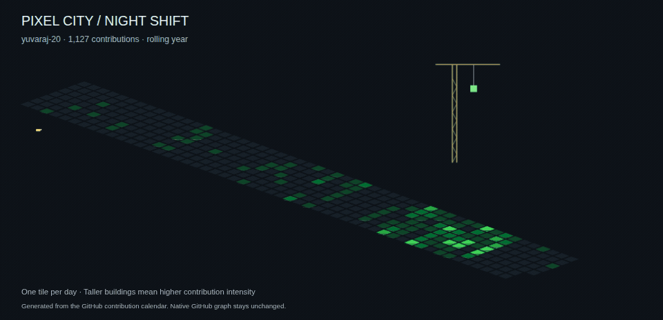

# Hi, I'm Yuva

Building **Craftelé** — storefront, seller workspaces, admin tools, and commerce infrastructure.

## My contribution city

## Engineering toolkit

- **Frontend:** React, Vite, Tailwind CSS, Zustand, React Query, React Router.
- **3D and design:** Three.js, React Three Fiber, Drei, Konva, Framer Motion.
- **Backend:** PHP, Laravel, Sanctum, MySQL, Redis, Horizon, Reverb.
- **Integrations:** Razorpay, Shiprocket, Twilio, Firebase.
- **Testing and monitoring:** Vitest, Testing Library, Playwright, axe-core, Pest, Mockery, Sentry.
- **Infrastructure:** Docker, Nginx, GitHub Actions, AWS Lightsail, S3.

The illustrations show product scope, not a claim that every capability is live.
